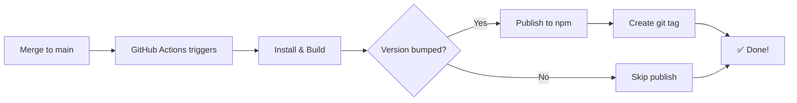

# Automatic Publishing Setup

## Status: ⚠️ Action Required

Automatic publishing workflow is ready but requires one-time npm token setup.

## What's Been Done ✅

1. **Created GitHub Actions workflow** (`.github/workflows/publish.yml`)
   - Publishes to npm on every merge to `main`
   - Only publishes when version in `package.json` has been bumped
   - Creates git tags automatically

2. **Version bumped to 0.1.1**
   - Includes mobile graphic opacity fix (0.15 → 0.04)
   - Includes `wordmarkSrc` prop addition
   - Ready to publish once workflow is active

3. **Created PR #3**
   - https://github.com/orstrax/orstrax-ui/pull/3
   - Ready to merge after npm token setup

## What You Need To Do 🔧

### Step 1: Create npm Access Token

1. Go to https://www.npmjs.com/settings/[your-username]/tokens
2. Click **"Generate New Token"**
3. Select **"Granular Access Token"** (recommended)
4. Configure the token:
   - **Token name**: `GitHub Actions - orstrax-ui`
   - **Expiration**: Choose expiration (90 days, 1 year, or custom)
   - **Packages and scopes**: Select "Read and write" for `@orstrax/ui`
   - **Organizations**: Select the `@orstrax` organization if applicable
5. Click **"Generate token"**
6. Copy the token (starts with `npm_...`) - you won't see it again!

### Step 2: Add Token to GitHub

1. Go to https://github.com/orstrax/orstrax-ui/settings/secrets/actions
2. Click **"New repository secret"**
3. Name: `NPM_TOKEN`
4. Value: Paste your npm token
5. Click **"Add secret"**

### Step 3: Verify Package Ownership

Make sure your npm account has publish access to `@orstrax/ui`:

```bash
# Check if package exists
npm view @orstrax/ui

# If it doesn't exist, you'll need to publish 0.1.0 manually first:
npm login
cd /path/to/orstrax-ui
npm publish --access public
```

### Step 4: Merge the PR

Once the token is added:
1. Merge PR #3
2. GitHub Actions will automatically publish `@orstrax/ui@0.1.1` to npm
3. Check the Actions tab to see the publish succeed

## How to Use Going Forward 🚀

### Publishing a New Version

1. Make your changes in a feature branch
2. **Bump the version** in `package.json`:
   - Patch (0.1.1 → 0.1.2): Bug fixes
   - Minor (0.1.1 → 0.2.0): New features
   - Major (0.1.1 → 1.0.0): Breaking changes
3. Create PR and get it reviewed
4. Merge to `main`
5. **Automatic publish happens!** 🎉

### Updating Desk (and other apps)

After a version is published:

```bash
cd /path/to/orstrax-desk
npm update @orstrax/ui
npm run build
# Test locally
# Deploy
```

Or pin to a specific version:

```bash
npm install @orstrax/ui@0.1.1
```

## Troubleshooting

### Workflow doesn't publish
- ✅ Check that `NPM_TOKEN` secret is set
- ✅ Check that version in `package.json` was bumped
- ✅ Check Actions tab for error logs

### "Version already exists" error
- This means the version in `package.json` hasn't been bumped
- Bump the version and push again

### Permission denied error
- Your npm account doesn't have access to `@orstrax` scope
- Contact the npm organization admin to add you

## What Happens When You Merge



## Current Version Status

- **Latest on main**: 0.1.0 (published manually)
- **In PR #3**: 0.1.1 (includes mobile graphic + wordmarkSrc changes)
- **After merge**: 0.1.1 will auto-publish

---

**Questions?** Check the workflow file: `.github/workflows/publish.yml`
